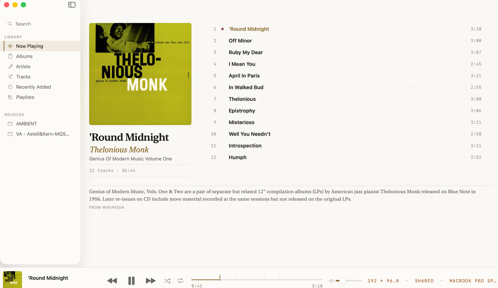
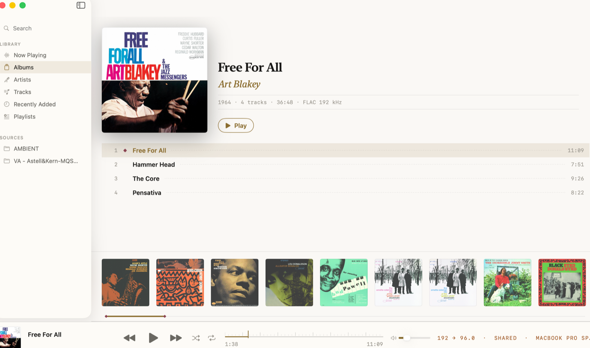

<p align="center">
  
</p>

<h1 align="center">Rubis Music</h1>

<p align="center">
  A hi-fi player for macOS that plays the file, not an interpretation of it.
</p>

<p align="center">
  
  
  
  
</p>

<p align="center">
  <a href="https://github.com/Di-kairos/rubis-releases/releases/latest"></a>
</p>

<p align="center">
  <sub>A player built for one listener, published because the audio path, the layout
  math and the release pipeline may be worth reading. Not a product: no support,
  no roadmap for feature requests. Issues and pull requests are welcome and
  answered when time allows.</sub>
</p>

---

<p align="center">
  
</p>

Rubis plays a lossless library — on your disk or on your own Navidrome server —
the way the file was mastered: the device sample rate follows the track, the
mixer is bypassed, the signal leaves the app untouched. Server tracks take the
same path: they are downloaded whole, never transcoded, and played as files. That claim is not taken on trust — `Tools/audio-verify` compares
output against 24 fixtures (44.1–192 kHz, 16/24-bit, FLAC/ALAC/WAV) and has to
pass before any change to the engine is committed.

| Measured | |
|---|---|
| Bit-perfect output | 24 of 24 fixtures |
| Cold start | 208–219 ms |
| Search on 100k tracks | under 50 ms |
| Scrolling 100k tracks | 59–60 fps on a 60 Hz display |
| Memory, 50k-track library | 221 MB |

Numbers that have not been measured are not claimed. Where the signal path is
degraded — a device that cannot follow the rate, a shared output — the badge in
the transport bar says so instead of hiding it.

## Install

Download the DMG from
[releases](https://github.com/Di-kairos/rubis-releases/releases/latest), drag
**Rubis Music** to Applications, launch it. The build is signed with a Developer
ID certificate and notarized by Apple, so it opens with a double click — no
right-click → Open, no Gatekeeper warning. Later versions arrive in-app through
Sparkle.

Requires macOS 15 or newer on Apple silicon.

## What it does

- **Bit-perfect playback** — exclusive device access (hog mode), automatic sample
  rate switching, no resampling, no software volume in the signal path. The badge
  in the transport bar tells the truth: rate, exclusivity, and any degradation.
- **Gapless** — track seams within an album are inaudible; the next decoder is
  armed ahead of time.
- **DSD** — DSF/DSDIFF via DoP when the DAC supports it, honest PCM conversion
  when it does not.
- **Output device pinning** — pick your DAC in Settings and stay on it, whatever
  the system default does.
- **Library at scale** — a 100k-track library loads off the main thread, full-text
  search answers under 50 ms, the shelf scrolls at 59–60 fps.
- **Sources** — folders on any volume; a disconnected disk greys tracks out
  instead of destroying history. A scan never deletes anything.
- **Your own server** — a Subsonic/Navidrome library appears next to the local
  one. Tracks are downloaded whole before they play, never transcoded
  (`format=raw`), so the bit-perfect path is the same one local files take; the
  next track is prefetched while the current one plays. The download cache has a
  ceiling you set and clears by hand. A server that stops answering greys out its
  own tracks and says so in one line — no alert.
- **A receipt for the signal path** — copy or save a plain-text report of
  everything between the file and the DAC, fingerprinted with SHA-256.
- **DAC dossier** — Settings → Audio asks the device what it can actually do:
  rates, bit depths, DoP ceiling, hardware volume, exclusive access, tested live.
- **A private history** — what you played, kept in a file on your Mac: top
  artists, top tracks, a recent feed, and one button that erases it.
- **Every outgoing request, listed** — Settings → Network names each connection
  the app has made: host, reason, outcome, bytes. On a clean install the list is
  empty.
- **Liner notes** — an optional note about the playing album, from Wikipedia and,
  for records Wikipedia does not cover, from Claude or DeepSeek with your own API
  key. Off by default: the app makes no network call you did not ask for.
- **The usual comforts** — playlists, queue with shuffle and repeat, media keys,
  Now Playing as a full-window screen, mini player, optional menu bar presence,
  position restored across launches.
- **Self-updating** — Sparkle 2, EdDSA-signed feed in
  [rubis-releases](https://github.com/Di-kairos/rubis-releases).

## Design — Jewel Box

Warm near-black instead of grey, serif display type for album and artist names,
a thread of gold marking selection rather than a filled bar, and a single garnet
◆ against the playing track — the only red in the interface. Albums are a shop
window: one record lit from the front, the collection on a shelf below it.

<p align="center">
  
</p>

The full system — palette, type scale, spacing grid, motion rules — is in
[DESIGN.md](DESIGN.md). Every colour, font and radius in the app comes from a
token in the `DesignSystem` package; literals outside it are forbidden.

## Architecture

Five SPM packages carry the work, and dependencies point one way:

| Package | Role |
|---|---|
| `EscapementCore` | Shared models and contracts; depends on nothing |
| `PlaybackEngine` | Core Audio HAL, hog mode, rate switching, gapless queue |
| `MusicLibrary` | Scanner, metadata, GRDB/SQLite, FTS5 search, cover cache |
| `SubsonicKit` | OpenSubsonic client, catalog mapping, download cache |
| `DesignSystem` | Every colour, font, spacing and radius token in the app |

The app target is a thin SwiftUI shell; the logic lives in the packages. Swift 6
with strict concurrency complete, and the build carries no warnings.

*The Xcode scheme and the core package are called `Escapement` — the project's
working title, kept because renaming a scheme breaks more than it fixes. The
product has been Rubis Music since 0.2.0.*

```bash
./Tools/test.sh          # swift test across the packages
./Tools/format.sh        # swift-format in place (run before committing)
./Tools/audio-verify     # the bit-perfect proof — required for engine changes
./Tools/make-dmg.sh      # Release build → signed, notarized, stapled DMG

# The app target needs full Xcode, not Command Line Tools:
xcodebuild -scheme Escapement -configuration Release
```

## Docs

| File | What's inside |
|---|---|
| [MANIFESTO.md](MANIFESTO.md) | Why this player exists, and what each claim rests on in the code (Russian) |
| [SPEC.md](SPEC.md) | Architecture, the audio contract, DB schema, performance budgets |
| [DESIGN.md](DESIGN.md) | Palette, typography, grid, components, motion |
| [TASKS.md](TASKS.md) | Phases with acceptance criteria |
| [DECISIONS.md](DECISIONS.md) | Why things are the way they are |
| [PROGRESS.md](PROGRESS.md) | Living state, release by release |
| [docs/manual-checklist.md](docs/manual-checklist.md) | What only ears and hardware can verify |
| [docs/third-party.md](docs/third-party.md) | Libraries the app ships, and their licences |

## Status

All eight planned phases are done — scaffold, design system, database, audio
engine, local library, interface, system integration, and Subsonic/Navidrome
support, the last of which was built and verified against a live Navidrome
instance. What is left is the part only ears and hardware can sign off:
[the manual checklist](docs/manual-checklist.md). Releases live in
[rubis-releases](https://github.com/Di-kairos/rubis-releases); the current one is
signed, notarized, and verified by checksum against the file published there.

Binaries bundle libraries from other people, including two under LGPL terms —
see [docs/third-party.md](docs/third-party.md).

## Licence

None yet, which by default means all rights reserved: read the code freely, but
copying it into your own project is not permitted until a licence file says
otherwise.
