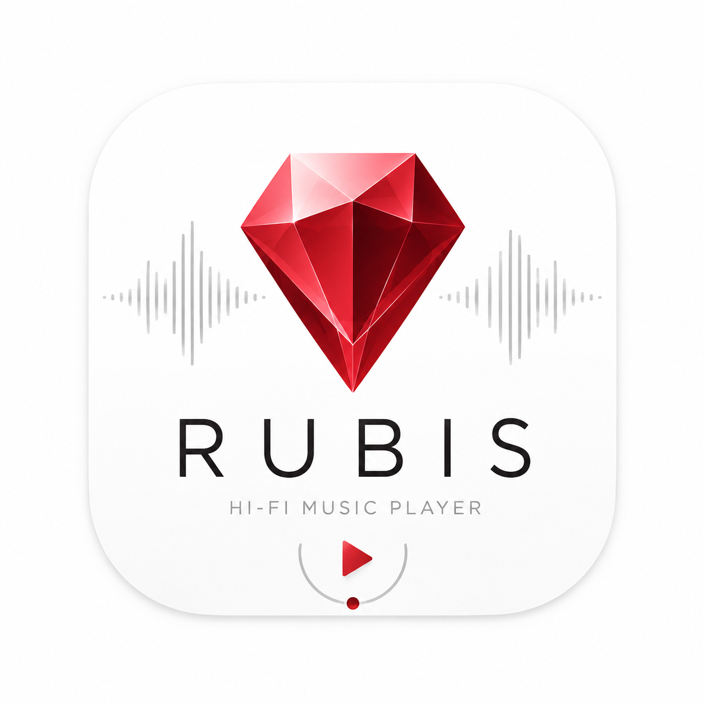

<p align="center">
  
</p>

<h1 align="center">Rubis Music</h1>

<p align="center">
  Personal hi-fi player for macOS. Bit-perfect or silent — never "close enough".
</p>

<p align="center">
  
  
  
  
</p>

---

Rubis plays a local lossless library the way the file was mastered: the device
sample rate follows the track, the mixer is bypassed, the signal leaves the app
untouched. The audio path is not "probably fine" — `Tools/audio-verify` proves
bit-perfect output on 24 fixtures (44.1–192 kHz, 16/24-bit, FLAC/ALAC/WAV) before
any engine change lands.

## What it does

- **Bit-perfect playback** — exclusive device access (hog mode), automatic sample
  rate switching, no resampling, no software volume in the signal path. The badge
  in the transport bar tells the truth: rate, exclusivity, and any degradation.
- **Gapless** — track seams within an album are inaudible; the next decoder is
  armed ahead of time.
- **DSD** — DSF/DSDIFF via DoP when the DAC supports it, honest PCM conversion
  when it does not.
- **Output device pinning** — pick your DAC in Settings and stay on it, whatever
  the system default does.
- **Library at scale** — 100k-track library loads off the main thread, full-text
  search answers under 50 ms, the grid scrolls at 59–60 fps.
- **Sources** — folders on any volume; a disconnected disk greys tracks out
  instead of destroying history. Files are never deleted by a scan.
- **The usual comforts** — playlists, queue with shuffle/repeat, media keys,
  Now Playing as a full-window screen, mini player, optional menu bar presence,
  position restore across launches.
- **Self-updating** — Sparkle 2, EdDSA-signed feed in
  [rubis-releases](https://github.com/Di-kairos/rubis-releases).

Design is its own thing: **Jewel Box** — warm near-black, serif display type,
a golden thread for selection, and a single garnet ◆ on the playing track.
No aggressive red anywhere.

## Architecture

Five SPM packages, dependencies point one way:

| Package | Role |
|---|---|
| `EscapementCore` | Shared models and contracts; depends on nothing |
| `PlaybackEngine` | Core Audio HAL, hog mode, rate switching, gapless queue |
| `MusicLibrary` | Scanner, metadata, GRDB/SQLite, FTS5 search, cover cache |
| `DesignSystem` | Every color, font, spacing, and radius token in the app |
| `SubsonicKit` | Empty shell until phase 6 (Navidrome/Subsonic) |

The app target is a thin SwiftUI shell; all logic lives in the packages.
Swift 6, strict concurrency complete, zero warnings.

## Build

```bash
./Tools/test.sh          # swift test for all five packages
./Tools/format.sh        # swift-format in-place (run before commit)
./Tools/audio-verify     # bit-perfect proof — required for engine changes
./Tools/make-dmg.sh      # Release build → installable DMG

# App target (requires full Xcode, not Command Line Tools):
xcodebuild -scheme Escapement -configuration Release
```

## Docs

| File | What's inside |
|---|---|
| `SPEC.md` | Technical spec: architecture, audio contract, DB schema, budgets |
| `DESIGN.md` | Design system: palette, typography, grid, components, motion |
| `TASKS.md` | Phases with acceptance criteria |
| `PROGRESS.md` / `DECISIONS.md` | Living state and decision log |
| `docs/manual-checklist.md` | Hardware acceptance: DAC, gapless, VoiceOver |

## Status

Phases 0–7 shipped: scaffold, design system, database, audio engine, local
library, full UI, system integration. Current releases live in
[rubis-releases](https://github.com/Di-kairos/rubis-releases). Next fork in the
road: phase 6 (Navidrome/Subsonic).

Personal project, single user, not for the App Store. Source is private;
binaries are ad-hoc signed — first launch on a new machine is right-click → Open.
